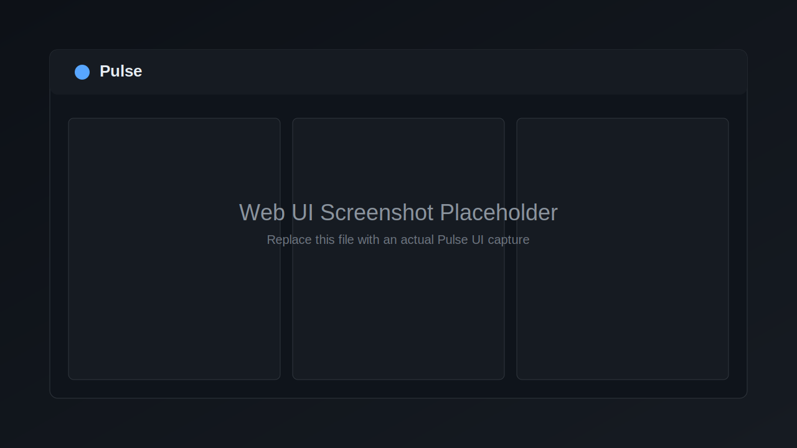

# Pulse

Pulse is a standalone project status tracker with webhook notifications. It provides:

- A local HTTP API for projects, members, status updates, and hook subscriptions
- A built-in web UI at `/`
- A `pulse` CLI for daily workflows
- Generic webhook delivery (including OpenClaw as one target)

## Features

- Lightweight Node.js + Express + SQLite stack
- Project lifecycle: create, edit, archive, list, inspect
- Member management per project (owner/contributor/watcher)
- Status history per project
- Global webhook hook definitions
- Per-project hook subscriptions with event filters
- Mustache body templates for outbound webhook payloads
- Hook execution logs and manual hook testing
- OpenClaw bootstrap command (`pulse hooks add-openclaw`)

## Quick Start

Requirements:

- Node.js 18+
- npm

Install and run:

```bash
npm install
node server.js
```

Open:

- <http://localhost:18800>

Optional: install the CLI globally from this repo:

```bash
npm link
pulse status
```

## Environment Variables

| Variable | Used by | Purpose | Default |
| --- | --- | --- | --- |
| `PORT` | server | HTTP listen port | `18800` |
| `PULSE_URL` | CLI | Base URL for `pulse` CLI requests (use `--url` for explicit override) | `http://localhost:18800` |
| `PULSE_API_KEY` | docs/reserved | Intended API key for deployments that add auth middleware; current server does not enforce it | unset |
| `PULSE_DATA_DIR` | docs/reserved | Intended override for data directory; current code stores DB in `./data/pulse.db` | `./data` (implicit) |

## API Endpoints

Base URL: `http://localhost:18800`

| Method | Route | Description |
| --- | --- | --- |
| `GET` | `/` | Web UI (static app from `public/`) |
| `GET` | `/health` | Health payload with status, timestamp, and port |
| `POST` | `/projects` | Create project (`name` required; optional `id`, `description`, `members[]`) |
| `GET` | `/projects` | List projects; use `?archived=true` to include archived items |
| `GET` | `/projects/:id` | Get project details, members, latest status |
| `PUT` | `/projects/:id` | Update project metadata (`name`, `description`, `archived`) |
| `DELETE` | `/projects/:id` | Archive project |
| `GET` | `/projects/:id/members` | List members |
| `POST` | `/projects/:id/members` | Add/replace member (`name` required, optional `role`) |
| `DELETE` | `/projects/:id/members/:name` | Remove member |
| `POST` | `/projects/:id/status` | Post status update (`author`, `text` required) |
| `GET` | `/projects/:id/history` | Status history; `?limit=<n>` (max 500) |
| `GET` | `/projects/:id/notifications` | List project hook subscriptions |
| `POST` | `/projects/:id/notifications` | Subscribe project to hook (`hook_id` required, optional `event_filter`) |
| `PUT` | `/projects/:id/notifications/:hookId` | Update subscription (`event_filter`, `enabled`) |
| `DELETE` | `/projects/:id/notifications/:hookId` | Unsubscribe project from hook |
| `GET` | `/hooks` | List all hook definitions |
| `POST` | `/hooks` | Create hook (`id`, `name`, `url` required; optional `method`, `headers`, `body_template`, `enabled`) |
| `GET` | `/hooks/:id` | Get hook details |
| `PUT` | `/hooks/:id` | Update hook fields |
| `DELETE` | `/hooks/:id` | Delete hook and related subscriptions |
| `GET` | `/hooks/:id/log` | Get hook-specific execution log (`?limit=<n>`, max 1000) |
| `POST` | `/hooks/:id/test` | Fire test payload; optional `?project=<id>` or JSON body fields |
| `GET` | `/hook-log` | Get global recent hook execution log (`?limit=<n>`, max 1000) |

Example:

```bash
curl -s http://localhost:18800/health | jq
```

## CLI Usage

CLI base command:

```bash
pulse --url http://localhost:18800 <command>
```

Global options:

- `--url <url>`: override server URL (same as `PULSE_URL`)
- `--json`: print raw JSON output

### Project Commands

- `pulse list|ls [--archived] [--json]`
- `pulse create <name> [description] [--id <id>] [--json]`
- `pulse get <id> [--json]`
- `pulse update <id> [text...] [--author <author>] [--json]`
- `pulse history <id> [--limit <n>] [--json]`
- `pulse edit <id> [--name <name>] [--description <desc>] [--json]`
- `pulse archive <id>`
- `pulse status [--json]`

Examples:

```bash
pulse create "SDK Migration" "Move API client to v2"
pulse update sdk-migration-abc12 "Rate limiting fixes are merged" --author clawd
pulse history sdk-migration-abc12 --limit 10
```

### Member Commands

- `pulse members add <project-id> <name> [--role owner|contributor|watcher]`
- `pulse members remove <project-id> <name>`
- `pulse members list|ls <project-id> [--json]`

Example:

```bash
pulse members add sdk-migration-abc12 alice --role owner
```

### Hook Commands

- `pulse hooks list|ls [--json]`
- `pulse hooks create <id> <name> <url> [--method <method>] [--headers <json>] [--template <text>] [--template-file <file>] [--json]`
- `pulse hooks get <id> [--json]`
- `pulse hooks update <id> [--name <name>] [--url <url>] [--method <method>] [--headers <json>] [--template <text>] [--template-file <file>] [--enable|--disable] [--json]`
- `pulse hooks delete|rm <id>`
- `pulse hooks test <id> [--project <id>] [--author <author>] [--text <text>] [--json]`
- `pulse hooks log <id> [--limit <n>] [--json]`
- `pulse hooks subscribe <project-id> <hook-id> [--events status,member,archive,edit]`
- `pulse hooks unsubscribe <project-id> <hook-id>`
- `pulse hooks subscriptions <project-id> [--json]`

Examples:

```bash
pulse hooks create notify-slack "Slack #eng" "https://hooks.slack.com/services/XXX/YYY/ZZZ" \
  --template '{"text":"[{{event.type}}] {{project.name}}: {{update.text}}"}'

pulse hooks subscribe sdk-migration-abc12 notify-slack --events status,archive
```

## Webhook Hooks

Pulse separates webhook setup into:

1. Global hook definitions (`/hooks`)
2. Project subscriptions (`/projects/:id/notifications`)

### Create a Hook

Create a reusable hook definition:

```bash
pulse hooks create notify-team "Team Relay" "http://localhost:18789/hooks/pulse" \
  --headers '{"Authorization":"Bearer <token>"}' \
  --template-file ./templates/pulse-openclaw.json
```

### Subscribe a Project

Subscribe for all events:

```bash
pulse hooks subscribe sdk-migration-abc12 notify-team
```

Subscribe for specific events only:

```bash
pulse hooks subscribe sdk-migration-abc12 notify-team --events status,archive
```

### Event Types

- `status`: new status update posted
- `member`: member added via API/CLI
- `edit`: project metadata updated
- `archive`: project archived
- `test`: only used by manual hook testing endpoint

### Mustache Template Context

`body_template` supports Mustache placeholders. Available fields:

- `{{project.id}}`
- `{{project.name}}`
- `{{project.description}}`
- `{{update.id}}`
- `{{update.author}}`
- `{{update.text}}`
- `{{update.created_at}}`
- `{{event.type}}`
- `{{timestamp}}`

Template example:

```json
{
  "text": "[{{event.type}}] {{project.name}} by {{update.author}}: {{update.text}}",
  "projectId": "{{project.id}}",
  "sentAt": "{{timestamp}}"
}
```

If rendered template is valid JSON, Pulse sends `Content-Type: application/json`; otherwise `text/plain`.

## OpenClaw Integration

Use `add-openclaw` to create/update a Pulse hook that targets OpenClaw and optionally patch `openclaw.json` mappings:

```bash
pulse hooks add-openclaw \
  --name "Discord via Gilfoyle" \
  --agent gilfoyle \
  --channel discord \
  --target 1476975040150114366
```

What it does:

1. Reads OpenClaw config (default: `~/.openclaw/openclaw.json`) for gateway port and hooks token
2. Creates or updates a Pulse hook pointing to `http://localhost:<port>/hooks/pulse`
3. Adds a `hooks.mappings` entry for `path: "pulse"` if missing

Useful options:

- `--openclaw-config <path>`
- `--openclaw-port <port>`
- `--token <token>`
- `--model <model>`

## Web UI

Pulse serves a built-in web UI at `/` for project and webhook management.



_Placeholder screenshot. Replace with a real capture when available._

## systemd Deployment

This repo includes [`pulse.service`](pulse.service). Example install:

```bash
sudo cp pulse.service /etc/systemd/system/pulse.service
sudo systemctl daemon-reload
sudo systemctl enable --now pulse
sudo systemctl status pulse
```

Recommended production adjustments before enabling:

- Set `WorkingDirectory` and `User` in `pulse.service`
- Pin the Node path used by `ExecStart`
- Optionally set `Environment=PORT=<port>`
- Optionally front with Nginx/Caddy for TLS and auth
